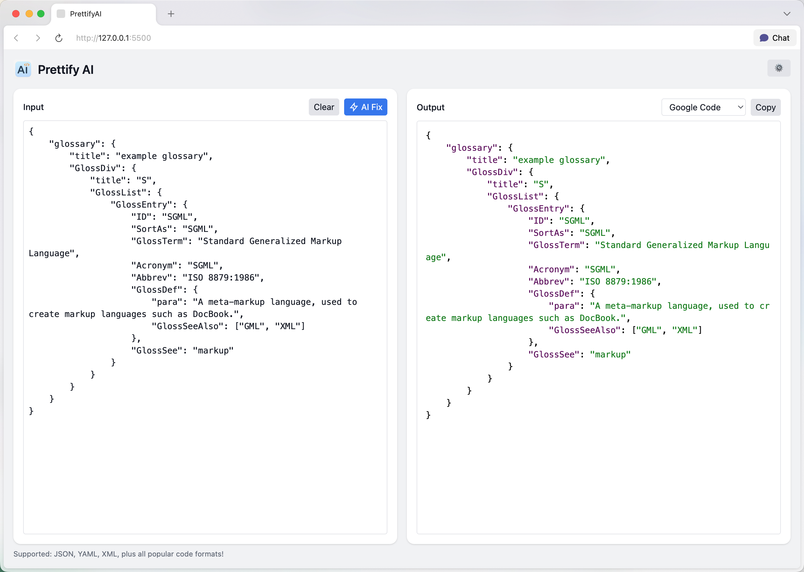

# Prettify-AI

**Prettify-AI** is a modern, user-friendly online tool for code and structured data formatting, highlighting, and AI-powered correction. Instantly beautify, highlight, and fix formats for JSON, YAML, XML, and all popular code/data formats.

## Features

- 🚀 **Instant Highlighting:** Auto-detects and highlights JSON, YAML, XML, Python, JavaScript, and most other popular code/data formats.
- 🤖 **AI-Powered Fix:** Integrates with multiple AI models (ChatGPT, DeepSeek, Claude, etc.) to automatically correct format/syntax errors with a single click.
- 🎨 **Multiple Themes:** Choose from 10+ beautiful syntax highlighting themes.
- 🖥️ **Modern UI:** Minimalist, intuitive, and responsive interface.
- ⚡ **Customizable Prompts:** Easily adjust the default AI prompt to match your needs.
- 📋 **Productivity Shortcuts:** One-click clear, copy, and paste functions for fast workflow.

## Getting Started

1. **Download or clone this repository.**
2. Open `index.html` in your browser to use Prettify-AI locally.
3. (Optional) To enable AI-powered fixing, open settings (⚙️ in the top right), choose a provider, and enter your API key.

## Usage

- **Input:** Paste or type any JSON, YAML, XML, code, or data on the left.
- **Output:** Instantly see highlighted and beautified results on the right.
- Use the **AI Fix** button to auto-correct invalid or messy input.
- Switch between color themes and easily copy results.

## Configuring AI Integration

1. Click the **Settings** button (⚙️) at the top right.
2. Select an AI provider and enter your API key.
3. You can customize the prompt sent to the AI (a recommended default is provided).

## Tech Stack

- Frontend: HTML + Tailwind CSS + Vanilla JavaScript
- Syntax Highlighting: [highlight.js](https://highlightjs.org/)
- Data Parsing: [js-yaml](https://github.com/nodeca/js-yaml), [DOMParser](https://developer.mozilla.org/en-US/docs/Web/API/DOMParser)
- AI Integration: Supports ChatGPT, DeepSeek, Claude, and more

## Screenshot

## License

MIT

---

**Contributions and pull requests are welcome!**